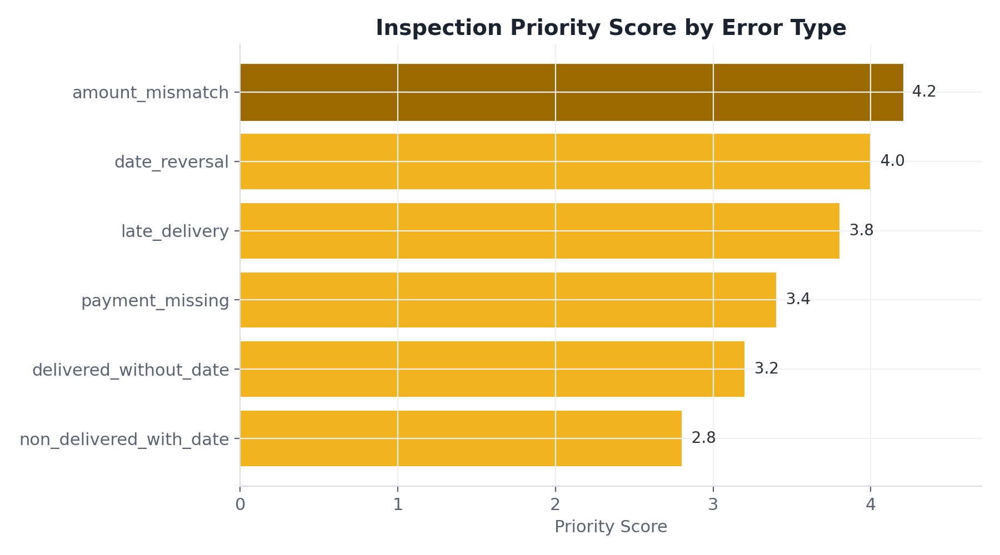
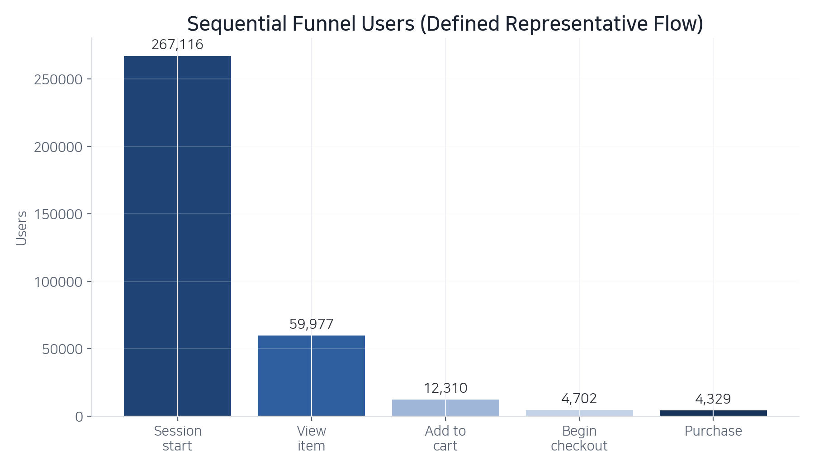
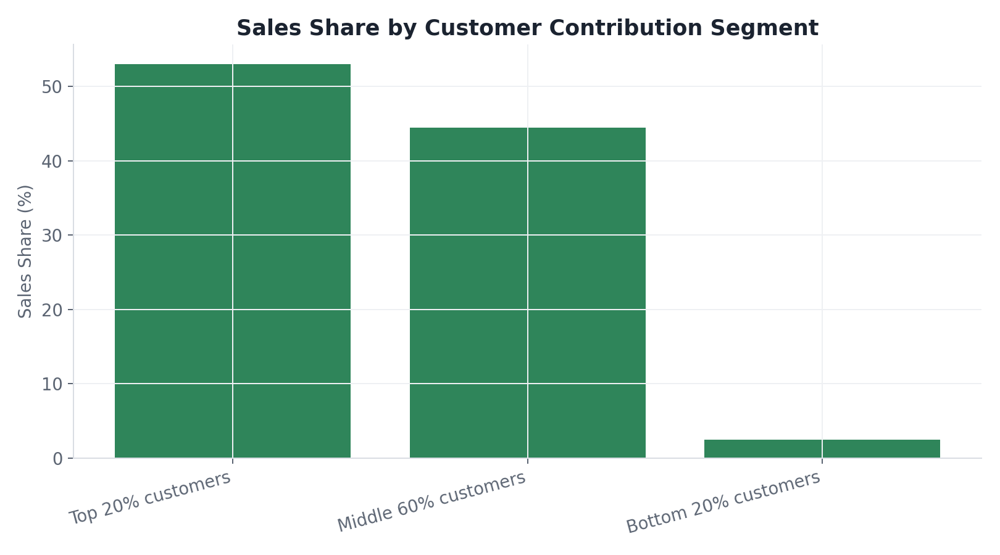
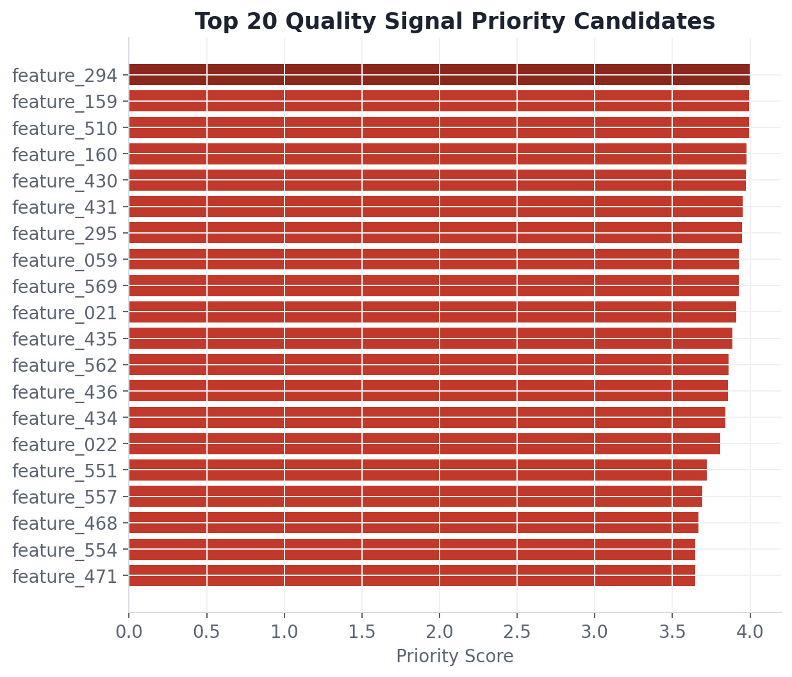

# Data Analysis Portfolio

공개 데이터로 **운영 정합성 · 서비스 퍼널 · 커머스 구조 · 제조 품질** 4개 도메인을 분석한 포트폴리오입니다.
SQL로 현황을 확인하고 결과를 어디까지 말할 수 있는지 정의한 뒤 무엇을 먼저 봐야 하는지 우선순위를 산정했습니다.

> **모든 프로젝트는 공개 데이터 기반 관찰 분석입니다.**
> 실제 기업 내부 데이터가 아니며 실제 개선 성과나 인과관계를 주장하지 않습니다.

---

## 한눈에 보기

| # | 프로젝트 | 분석 규모 | 찾은 것 | 내린 판단 |
|---|---|---|---|---|
| [01](./01_operation_data_quality/) | 운영 데이터 정합성 | 주문 약 9.9만 건 | 배송 지연 후보 **7,827건(7.87%)**, 날짜 역전 1,382건(1.39%), 금액 불일치 250건(0.25%) | 건수 1위는 배송 지연이지만 영향도·긴급도를 가중하면 **250건짜리 금액 불일치가 점검 1순위**(가중 4.2) |
| [02](./02_service_funnel_analysis/) | 서비스 퍼널 | session_start 약 267,116 | 조회 → 장바구니 이탈 **79.5%**, 장바구니 → 결제시작 61.8%, 결제시작 → 구매 7.9% | 초기 가설(디바이스별 차이)의 크기가 작아 **분석 축을 '어떤 환경'에서 '어떤 행동 전환'으로 전환** |
| [03](./03_business_commerce_analysis/) | 커머스 고객·매출 | 고객 2,500명 / 장바구니 276,484건 | 상위 20% 고객이 매출의 **53.0%** (파레토 구조) / TypeA 캠페인 응답률 약 16%로 최고 | 무작위 배정 데이터가 아니므로 **'효과'가 아닌 '관찰된 반응 차이'까지만** 결론 |
| [04](./04_manufacturing_quality_analysis/) | 제조 품질 신호 | 1,567행 × 590개 공정 신호 | Fail 비율 **6.6%(104건)** 의 라벨 불균형, 결측 40% 이상 신호 다수 | 결측 과다 신호는 점검 후보가 아니라 **데이터 품질 관리 후보로 분리** / 원인 규명 대신 점검 후보만 도출 |

> 각 프로젝트 폴더의 `docs/`에 분석 기획·데이터 정의·지표 정의·전처리 기준을 문서로 남겼습니다.

---

## 01. 서비스 운영 데이터 품질 관리

**데이터** Olist Brazilian E-Commerce (Kaggle) · **기술** SQL, Python, scipy

**문제** 주문·결제·배송·판매자 테이블이 서로 맞지 않는 건을 찾아야 했습니다. 다만 공개 데이터라서 무엇이 진짜 오류인지 확정할 수 없었습니다.

**한 것** 테이블 간 정합성 기준을 먼저 정의하고 SQL 8개로 누락·날짜 역전·금액 불일치 후보를 탐지했습니다. 결과는 '오류 확정'이 아니라 **'검수 후보'** 로 정의했습니다. 발생 건수·영향도·긴급도를 가중해 검수 우선순위를 산정했습니다.

**찾은 것** 약 9.9만 건의 주문에서 배송 지연 후보 7,827건(7.87%), 날짜 역전 1,382건(1.39%), 금액 불일치 250건(0.25%)을 탐지했습니다. 배송 지연 건의 평균 리뷰는 2.57점으로 정상 4.21점과 차이가 있었습니다(Welch t=85.2, p<0.001).

**판단** 건수만 보면 배송 지연이 압도적입니다. 그러나 영향도와 긴급도를 가중하니 250건뿐인 금액 불일치가 우선순위 1위였습니다(가중 점수 4.2). **가장 많이 발생한 문제와 가장 먼저 봐야 할 문제는 다르다**는 것이 이 프로젝트의 결론입니다.



---

## 02. GA4 기반 서비스 퍼널 분석

**데이터** GA4 Ecommerce Sample (BigQuery Public) · **기술** BigQuery SQL, Python

**문제** 이커머스 퍼널에서 어느 구간의 손실이 가장 큰지 확인해야 했습니다.

**한 것** `session_start → view_item → add_to_cart → begin_checkout → purchase` 5단계 순차 퍼널을 정의했습니다. 최종 구매 여부 하나로는 개선 지점을 특정할 수 없어 **구매 의도가 점점 구체화되는 행동**을 단계로 두었습니다. BigQuery SQL로 단계별 고유 사용자 수를 집계하고 직전 단계 대비 전환율·이탈률과 누적 전환율을 계산했습니다.

**찾은 것** session_start 약 267,116 기준으로 view_item → add_to_cart 이탈률이 79.5%로 가장 높았습니다. 이후 add_to_cart → begin_checkout 61.8%, begin_checkout → purchase 7.9%였습니다. 디바이스별 전환율 차이는 크지 않았습니다.

**판단** 처음에는 디바이스나 카테고리처럼 특정 환경에서 전환 문제가 크게 나타날 것이라고 봤습니다. 실제로는 환경 차이보다 **단계별 차이가 훨씬 뚜렷**했습니다. 세그먼트를 더 쪼개는 대신 전체 사용자에게 공통으로 나타나는 병목을 먼저 확인하는 쪽으로 분석 축을 바꿨습니다. 가설을 유지하는 것보다 **데이터에서 나타난 차이의 크기로 우선순위를 다시 정하는 것**이 중요하다고 봤습니다.



---

## 03. 커머스 고객·매출·프로모션 분석

**데이터** Dunnhumby - The Complete Journey (Kaggle) · **기술** SQL, Python, pandas

**문제** 매출을 만드는 고객·상품·프로모션 구조를 파악해야 했습니다.

**한 것** 고객군 매출 기여도, 재구매 행동, 상품군 매출 구조, 쿠폰·캠페인 반응 차이를 SQL 8개로 분석했습니다. 고객 세분화는 매출액 한 축이 아니라 **매출 기여도 → 재구매 행동 → 상품군 구매 구조 → 캠페인 반응** 네 축을 연결해 봤습니다. 세분화의 목적이 고객에게 이름을 붙이는 것이 아니라 이후 액션을 다르게 가져가는 것이라고 봤기 때문입니다.

**찾은 것** 고객 2,500명·장바구니 276,484건을 분석했습니다. 매출 상위 20% 고객이 전체 매출의 53.0%를 차지하는 파레토 구조였습니다. 캠페인 유형 중 TypeA의 응답률이 약 16%로 가장 높았습니다.

**판단** TypeA 응답률이 가장 높다고 해서 "TypeA가 가장 효과적"이라고 말하지 않았습니다. 이 데이터는 고객을 무작위로 캠페인에 배정한 실험 데이터가 아니어서 TypeA를 받은 고객 자체가 원래 구매 가능성이 높았을 가능성을 배제할 수 없습니다. **"TypeA의 관찰 응답률이 가장 높았다"까지만** 쓰고 결과를 '캠페인 효과'가 아니라 '관찰된 반응 차이'로 표기했습니다.



---

## 04. 반도체 공정 품질 신호 분석

**데이터** UCI SECOM (UCI ML Repository) · **기술** SQL, Python, numpy

**문제** 공정 측정값과 품질(Pass/Fail) 결과를 연결해 어떤 신호를 먼저 점검해야 할지 정해야 했습니다. 변수는 전부 익명화되어 있었습니다.

**한 것** 1,567행·590개 공정 신호의 결측률, Pass/Fail 그룹 간 차이, 변동성을 분석했습니다. 결측 40% 이상인 신호는 점검 후보가 아니라 **데이터 품질 관리 후보로 따로 분리**했습니다. 그룹 차이·변동성·결측 위험·극단값을 가중해 점검 우선순위를 산정했습니다.

**찾은 것** Fail 비율은 6.6%(104건)로 라벨 불균형이 컸습니다. 결측 40% 미만 중 그룹 차이와 변동성이 큰 신호(feature_294 등)를 우선 점검 후보로 정리했습니다.

**판단** 변수가 익명화되어 있어 불량의 원인을 규명할 수 없다는 점을 먼저 명시했습니다. 그래서 원인 규명 대신 **점검 후보 도출**까지만 목표로 삼았습니다. 보조 베이스라인 모델(numpy 로지스틱 회귀, ROC-AUC 약 0.67)은 결론이 아니라 참고 지표로만 사용했습니다.



---

## 분석 원칙

이 포트폴리오에서 지킨 기준입니다.

- 모든 분석은 **공개 데이터 기반 관찰 분석**입니다. 기업 내부 데이터처럼 표현하지 않습니다.
- **인과효과를 단정하지 않습니다.** 무작위 배정이 아닌 데이터에서 나온 차이는 '관찰된 반응 차이'로 씁니다.
- 결과는 **검수 후보 / 우선 점검 후보 / 반응 차이 / 추가 검증 필요** 수준으로 표현합니다.
- **데이터의 한계를 결과와 함께 적습니다.** (라벨 불균형, 변수 익명화, 선택 편향 등)
- 분석 기획·데이터 정의·지표 정의·전처리 기준을 `docs/`에 문서로 남겨 재현 가능하게 했습니다.

---

## 저장소 구조

```
data-analysis-portfolio/
├─ 01_operation_data_quality/          # SQL 8개 · Python · figures · docs · reports
├─ 02_service_funnel_analysis/         # BigQuery SQL · Python · charts · docs · reports
├─ 03_business_commerce_analysis/      # SQL 8개 · Python · outputs · docs · reports
├─ 04_manufacturing_quality_analysis/  # SQL 8개 · Python · outputs · docs · reports
└─ README.md
```

각 프로젝트 폴더 공통 구성

| 폴더 | 내용 |
|---|---|
| `sql/` | 분석 SQL 쿼리 |
| `scripts/` · `python/` | Python 분석 실행 코드 |
| `data/` | 원본 배치 안내 및 결과 CSV |
| `figures/` · `charts/` · `outputs/` | 차트 이미지 |
| `docs/` | 분석 기획 · 데이터 정의 · 지표 정의 · 전처리 기준 |
| `reports/` | 결과 보고서 (PPT/PDF) |
| `BEGINNER_GUIDE.md` | 처음 실행하는 사람을 위한 단계별 안내 |

---

## 실행 방법

각 프로젝트 폴더의 `BEGINNER_GUIDE.md`를 먼저 확인하세요. 공통 실행 흐름은 아래와 같습니다.

```bash
pip install -r requirements.txt
python scripts/run_analysis.py
```

**원본 데이터 필요 여부**

| 프로젝트 | 원본 데이터 |
|---|---|
| 01 | Kaggle에서 Olist 데이터를 내려받아 `data/raw/`에 배치 |
| 02 | 불필요. 제공된 BigQuery 결과 CSV로 차트 재생성 가능 |
| 03 | Kaggle에서 Dunnhumby 데이터를 내려받아 `data/raw/`에 배치 |
| 04 | 불필요. `data/raw/uci-secom.csv` 포함 |

---

## 데이터 출처 및 라이선스

- **01 Olist Brazilian E-Commerce (Kaggle)** — 원본 CSV는 저장소에 포함하지 않으며 Kaggle에서 직접 내려받아 사용합니다 (원 출처 이용 약관 적용).
- **02 GA4 Ecommerce Sample (Google BigQuery Public Dataset)** — 원본 로그는 BigQuery에서 조회하며 저장소에는 분석 결과 CSV만 포함합니다.
- **03 Dunnhumby - The Complete Journey (Kaggle)** — 원본 CSV는 저장소에 포함하지 않으며 Kaggle에서 직접 내려받아 사용합니다 (원 출처 이용 약관 적용).
- **04 UCI SECOM (UCI Machine Learning Repository, DOI: 10.24432/C54305)** — Creative Commons Attribution 4.0 International (CC BY 4.0). 출처 표기를 조건으로 재배포가 허용되어 `04_manufacturing_quality_analysis/data/raw/uci-secom.csv`로 포함했습니다.
